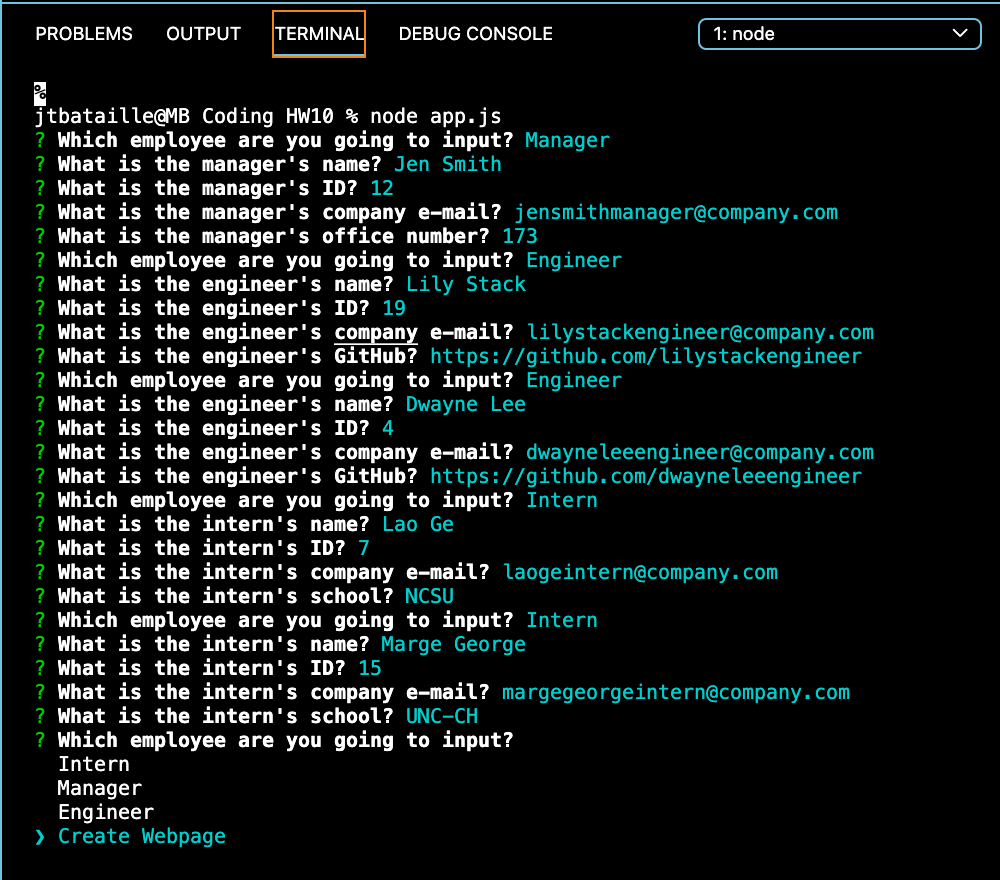
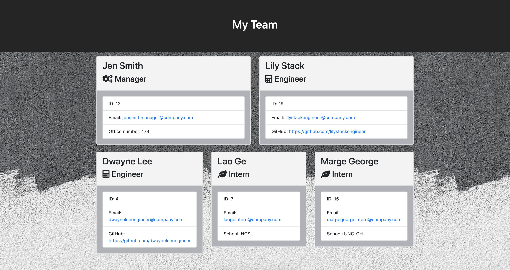

# Team Website Generator

## Table of Contents
* [Description](#description)
* [Installation](#description)
* [Technologies Used](#technologies-used)
* [Tests](#tests)
* [Application Demo](#application-demo)
* [Contact Information](#contact-information)

## Description
This application uses Node CLI to take in information from the user regarding his/her workplace team to render an HTML webpage with the information given. The desired information has overlap as well as differentiate based on the job-type. For example, while all job titles will be asked for a name, ID, and email, a manager will be asked for his/her office number, an intern for his/her school, and an engineer for his/her GitHub profile URL.

This information will then be used to create cards and render an HTML page which can be used to centralize this information for the team and/or for any other interested party.

## Installation
As a user, after cloning this GitHub repository, the user will need to run the following command on an inegrated terminal:

<code>npm install inquirer</code>

This will install the package "inquirer," which is used to run this CLI.

## Technologies Used
Node JS, JavaScript, Inquirer, Jest

## Tests
In order to test this program, use the following commands:

<code>npm install jest</code>

<code>npm run test</code>

These commands will run the test.js files within the test directory:
  1. Employee.test.js
  2. Engineer.test.js
  3. Intern.test.js
  4. Manager.test.js

## Application Demo
With inquirer installed as laid out above in [Installation](#installation), the user will open an integrated terminal and use the command <code>node app.js</code> This will queue a series of questions from inquirer to garner information about the team, as seen here:

From this input, an HTML page is saved into the output directory, and a file entitled "team.html" is generated, which may then be viewed in the browser, as seen here:

## Contact Information
* Jarrod Bataille
  * Portfolio Webpage: https://jtbataille.github.io/
  * GitHub Profile: https://github.com/jtbataille
  * E-mail Address: jtbataille@gmail.com

- - -
Copyright © 2007 Free Software Foundation, Inc. <https://fsf.org/>
